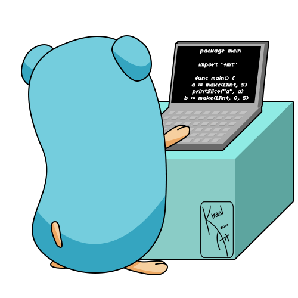

# myGoRepo

## Hey! Welcome to my GoRepo

I'm learning a bit about GoLang, and I'll post here my first code.
In the near future, I want to visit this repo and think, "wow how you evolve and have learned so much cool stuff."  
Feel free to collaborate by pointing out sources of good research. I will be very happy with your collaboration.